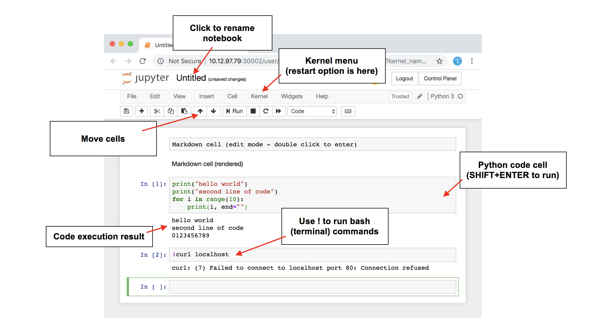
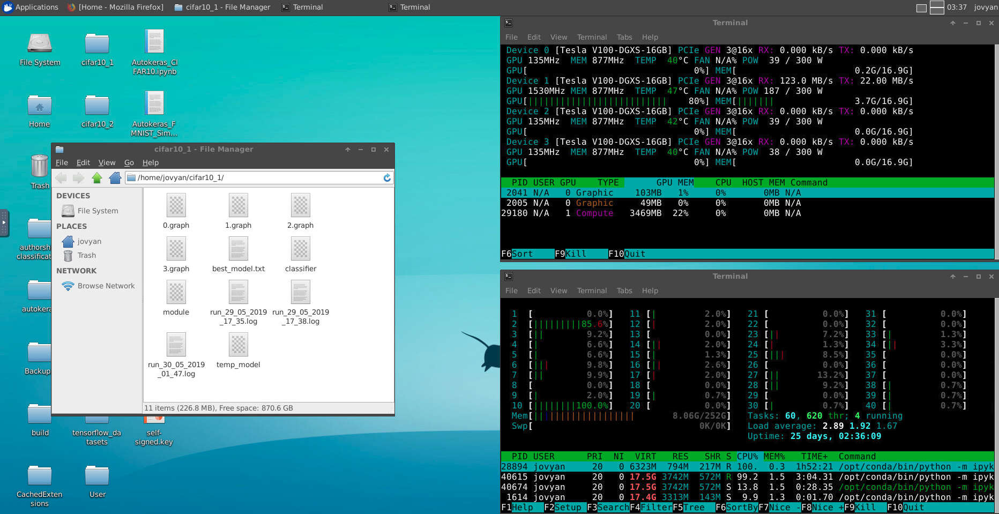

# End User Guide

**Contents**

* [JupyterHub](#jupyterhub)
* [Jupyter Notebook](#jupyter-notebook)
* [JupyterLab](#jupyterlab)
* [Desktop](#desktop)

## JupyterHub

You will be able to access the JupyterHub service through the main url. By default, you will see a login screen.

Once the administrator provisions you an account, you will be able to log in and spawn a new GPU/CPU instance.

## Jupyter Notebook

After you log into one of the two JupyterHub nodes and spawn a server, you will be presented with the file browser UI, from which you can upload, download, create and open files. Alternatively, you can also choose to use the more modern [JupyterLab](#jupyterlab) UI.

### File Browser

This is the UI which you use to browse your Notebook's filesystem and interact with the files.


### Notebook UI

You can create a new Jupyter Notebook with a **Python 3 kernel** by selecting 'New' > 'Python 3'. You will then be presented with the Notebook UI. 

You can run `!nvidia-smi` or `!gpustat` to check if GPUs are accesible from the notebook.



### TensorBoard

```
TODO, but it works
```

## JupyterLab

You can use JupyterLab instead of Jupyter Notebook. Simply replace `tree?` in the URL with `lab`.

TensorBoard works as well.

## Desktop 

Under "New" menu, you will an additional option for "VNC Desktop". Click on that, and a new browser tab will open with your virtual desktop interface.


**Please note that first start-up can take a while!**

It might appear to freeze at a black screen. After about 1 min you will get your virtual desktop.




